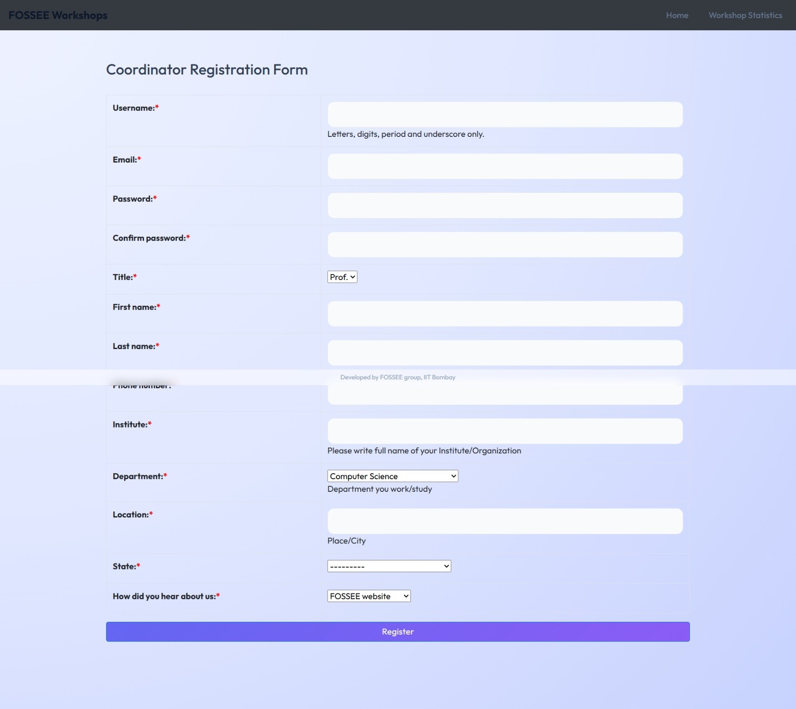
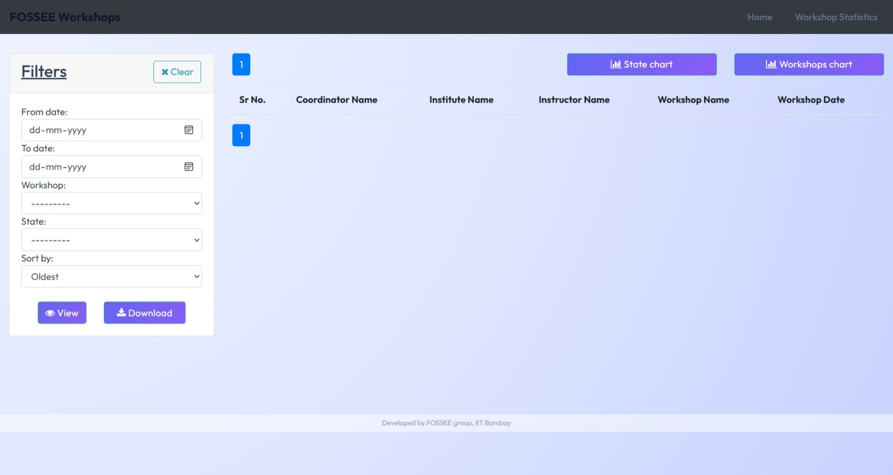
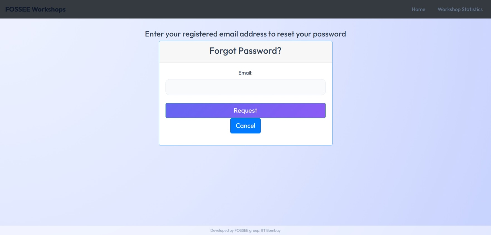

# UI/UX Enhancement – Workshop Booking Platform

## 📌 Overview

This project focuses on improving the UI/UX of the existing Workshop Booking platform provided by FOSSEE. The goal was to enhance usability, responsiveness, and visual design while maintaining the core functionality of the application.

The redesign prioritizes clarity, accessibility, and a modern user experience, especially for mobile users.

---

## 🚀 Features & Improvements

### 🔐 Login Page

* Redesigned layout with centered card UI
* Added side visual panels for better aesthetics
* Improved input styling and spacing
* Added clear error handling feedback

### 📝 Registration Page

* Replaced table-based form with modern card layout
* Improved form readability and structure
* Added consistent input styling and spacing
* Enhanced button visibility and interaction

### 📊 Workshop Statistics Page

* Converted layout into a dashboard-style UI
* Introduced sidebar filter panel
* Improved table alignment and spacing
* Added better visual hierarchy for charts and controls

### 🔑 Forgot Password Page

* Redesigned into a clean, centered success card
* Improved messaging clarity
* Added consistent button styling

### 📧 Email Confirmation / Reset Success Page

* Added modern success UI with visual feedback
* Improved alignment and spacing
* Maintained consistency with login and auth flow

---

## 🎨 Design Principles

The following principles guided the redesign:

* **Clarity & Simplicity** – Reduced clutter and improved readability
* **Consistency** – Unified styles across all authentication pages
* **Visual Hierarchy** – Proper spacing, typography, and alignment
* **Feedback** – Clear success/error states for user actions
* **Accessibility** – Improved contrast and input usability

---

## 📱 Responsiveness

* Designed layouts using flexible containers and modern CSS (Flexbox/Grid)
* Optimized UI for smaller screens (mobile-first approach)
* Hid non-essential decorative elements on mobile devices
* Ensured forms and buttons are easily clickable on touch devices

---

## ⚖️ Design vs Performance Trade-offs

* Used lightweight CSS instead of heavy UI libraries to maintain performance
* Limited use of animations to avoid performance overhead
* Optimized layout without introducing unnecessary JavaScript complexity

---

## 🧠 Challenges & Approach

### Challenge:

Transforming a basic, table-based UI into a modern design while keeping Django templates intact.

### Approach:

* Gradually refactored each page instead of rewriting everything
* Focused on reusable styling patterns
* Ensured backend compatibility while improving frontend

---

## 📸 Visual Showcase

---

### 🔐 Home Page

|  |

### 🔐 Login Page

| Before | After |
|--------|-------|
| |  |

---

### 📝 Registration Page

| Before | After |
|--------|-------|
| |  |

---

### 📊 Workshop Statistics Page

| Before | After |
|--------|-------|
| |  |

---

### 🔑 Forgot Password Page

| Before | After |
|--------|-------|
| |  |

---

### 📧 Email Confirmation Page

|  |

---

## 🛠️ Setup Instructions

1. Clone the repository:

```bash
git clone https://github.com/your-username/workshop_booking.git
cd workshop_booking
```

2. Create virtual environment:

```bash
python -m venv env
source env/bin/activate  # Windows: env\Scripts\activate
```

3. Install dependencies:

```bash
pip install -r requirements.txt
```

4. Run migrations:

```bash
python manage.py migrate
```

5. Start server:

```bash
python manage.py runserver
```

---

## ✅ Submission Checklist

* ✔ Clean and structured code
* ✔ Progressive git commits
* ✔ UI improvements across multiple pages
* ✔ README with reasoning and setup
* ✔ Screenshots included

---

## 📬 Submission

Name: Advay Bhagat

Institution Name: VIT Bhopal

Email Id: ad14bhagat@gmail.com

Repository link: *https://github.com/advay-demo/workshop_booking*

---

## 💡 Final Note

The goal of this project was not just visual improvement, but creating a smoother and more intuitive user experience while keeping performance and simplicity in mind.
